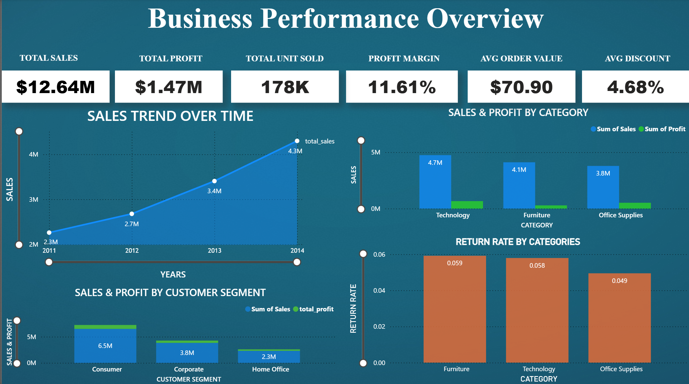
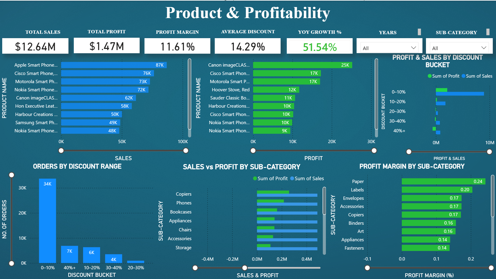
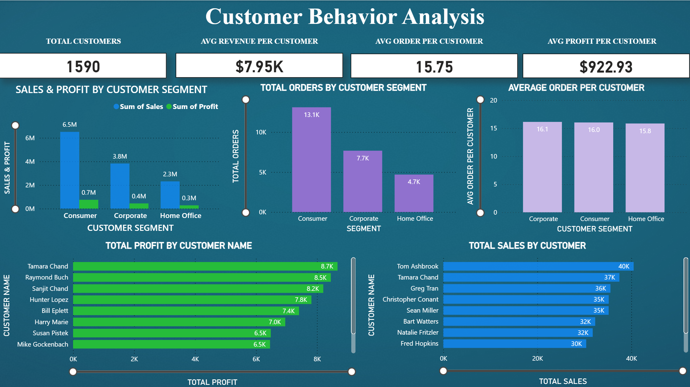
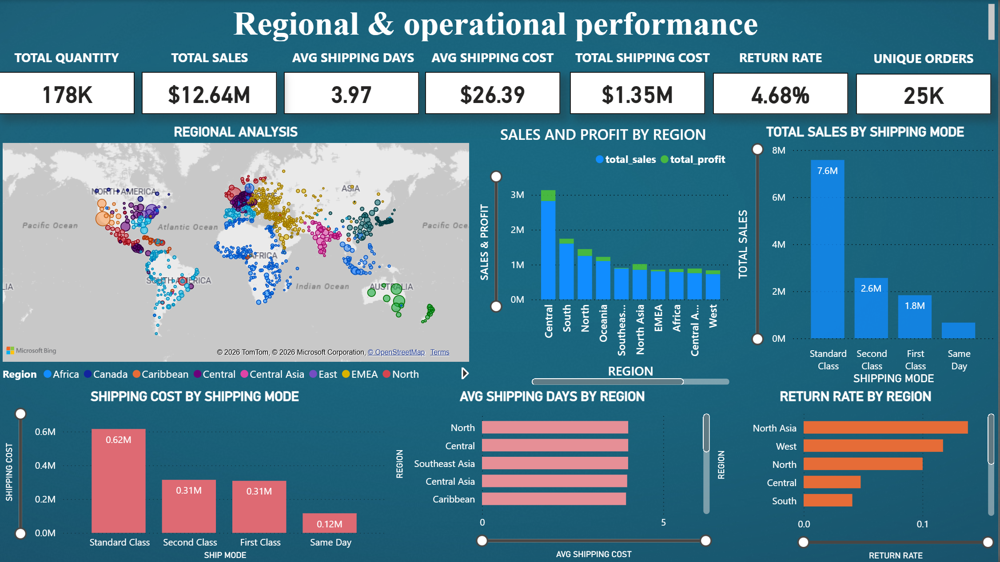
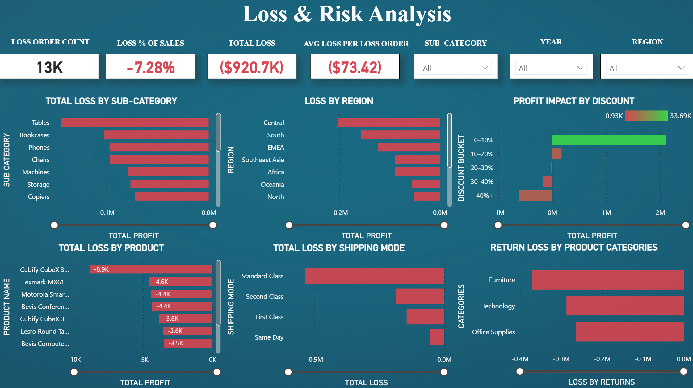

# 📊 Superstore Analytics — End-to-End Data Analytics Project


> A full-stack data analytics project on global retail data (2011–2014) — from raw CSV ingestion through SQL Star Schema design and Python EDA, to a 5-page interactive Power BI dashboard with actionable business insights.

---
## 🎯 Problem Statement

Retail businesses often struggle with hidden profitability issues despite strong sales growth. High revenue does not always translate into high profit due to factors like excessive discounting, product returns, inefficient logistics, and regional cost variations.

The objective of this project is to analyze a global retail dataset to identify:

- Where the business is making or losing money  
- Which factors are driving profit erosion  
- Which products, regions, and customers contribute to losses  
- Operational inefficiencies impacting overall performance  

This analysis aims to uncover **data-driven insights** that can help stakeholders improve profitability, optimize operations, and make better strategic decisions.

## 💼 Why This Analysis Matters

In a competitive retail environment, relying on revenue alone can be misleading. Businesses need to understand **profit drivers and leakages** at a granular level.

This project addresses key real-world business challenges:

- 📉 Identifying **profit leakage** caused by over-discounting and returns  
- 📦 Improving **operational efficiency** by analyzing shipping delays  
- 🌍 Understanding **regional performance differences**  
- 👤 Detecting **unprofitable customer behavior**  
- 📊 Enabling **data-driven decision making** instead of intuition  

By solving these problems, the analysis helps transform raw transactional data into **actionable business strategies**.

## 📦 Dataset Overview

- **Source:** Kaggle — Superstore Global Sales Dataset  
- **Time Period:** 2011 to 2014  
- **Records:** ~50,000+ transactions  
- **Type:** Retail transactional data  

### Key Features:

- **Order Details:** Order ID, Order Date, Ship Date  
- **Customer Info:** Customer Name, Segment, Region  
- **Product Info:** Category, Sub-category, Product Name  
- **Sales Metrics:** Sales, Profit, Quantity, Discount  
- **Operational Data:** Shipping Mode, Shipping Cost  
- **Returns Data:** Returned orders indicator  

### Data Characteristics:

- Sales and shipping costs are **right-skewed** (few high-value orders)  
- Profit contains both **high gains and significant losses**  
- Discounts are applied in **discrete levels (0%, 20%, 50%)**  
- Returns impact both **revenue and profitability**  

This dataset simulates a real-world retail environment, making it ideal for end-to-end data analysis and business decision modeling.

## 🚀 Key Highlights

- Built a **complete end-to-end pipeline**: CSV → SQL Star Schema → Python → Power BI
- Designed a **relational data model** with 1 fact table + 3 dimension tables
- Identified critical **25% discount threshold** — crossing it causes direct profit losses
- Quantified **$100K+ annual profit loss** from returns — traced to Furniture & Central region
- Flagged **9,312 late shipments** causing measurable profitability drag in operations
- Developed a **5-page interactive Power BI dashboard** with DAX measures & drill-down filters
- Wrote **7 modular SQL scripts + 7 Python notebooks** — one per analytical domain
- Engineered **YoY & MoM profit trend features** — confirmed 51.54% year-over-year growth

---

## 📈 Business KPIs at a Glance

| Metric | Value |
|---|---|
| Total Sales | $12.64M |
| Total Profit | $1.47M |
| Profit Margin | 11.61% |
| Total Orders | 25K+ |
| Total Customers | 1,590 |
| Return Rate | 4.68% |

---

## 🔧 Project Pipeline

### Stage 01 — SQL (Data Engineering & Analysis)
- Imported raw Kaggle CSV into MySQL as `orders_raw`
- Designed a **Star Schema** (1 fact + 3 dimension tables)
- Wrote 8 modular query scripts covering all analytical domains
- **Tools:** MySQL, DDL/DML, Joins, CTEs, Aggregations

### Stage 02 — Python (Visualisation & Feature Engineering)
- Connected MySQL to Python via **SQLAlchemy**
- Built 7 dedicated Jupyter notebooks mirroring SQL query structure
- Engineered **YoY & MoM profit trend** features for time-series analysis
- **Tools:** Pandas, SQLAlchemy, Matplotlib, Seaborn, Jupyter

### Stage 03 — Power BI (Interactive Dashboard)
- Imported the Star Schema directly into Power BI
- Built a `dates` dimension table from `order_date` (Month, Year columns)
- Created **DAX measures** for all KPIs across 5 interactive dashboard pages
- **Tools:** Power BI, DAX, Power Query, Bing Maps

---

## 🧠 Design Decisions

| Decision | Reason |
|---|---|
| **Star Schema** over flat table | Better query performance, reduced redundancy, scalable for Power BI relationships |
| **Modular SQL scripts** per domain | Independently readable, testable, and maintainable — not one monolithic file |
| **SQL queries reused in Python** via SQLAlchemy | Ensures visualisation layer stays consistent with database logic |
| **Date dimension table** in Power BI | Enables proper time-series filtering and time intelligence functions |

---

## 🗄️ Database Schema

```
                 ┌─────────────┐              ┌─────────────┐
                 │  Products   │              │   Returns   │
                 │─────────────│              │─────────────│
                 │ product_id  │              │  return_id  │
                 │ product_name│              │  returned   │
                 │ category    │              └──────┬──────┘
                 │ sub_category│                     │ 1:N
                 └──────┬──────┘                     │
                        │ 1:N          ┌─────────────▼──────────────┐
                        └─────────────►│        orders (FACT)        │
                                       │────────────────────────────│
                 ┌─────────────┐       │ order_id (PK)              │
                 │  Customers  │       │ product_id (FK)            │
                 │─────────────│       │ customer_id (FK)           │
                 │ customer_id ├──────►│ return_id (FK)             │
                 │ customer_name│      │ order_date · ship_date     │
                 │ segment     │       │ sales · profit · discount  │
                 │ region      │       │ quantity · shipping_cost   │
                 └─────────────┘       │ ship_mode                  │
                                       └────────────────────────────┘
```

---

## 📓 Analysis Modules

| # | Module | Key Output |
|---|---|---|
| 1.1 | Exploratory Data Analysis | Correlation matrix, distribution analysis. Profit–discount correlation = –0.32 |
| 1.2 | Sales & Profit Analysis | YoY & MoM trends. 51.54% growth. Technology = highest margin; Furniture = lowest |
| 1.3 | Regional & Geographic Analysis | Central leads volume. Canada = best margins. SE Asia & EMEA show profit gap |
| 1.4 | Customer Segment Analysis | Consumer segment leads. Flagged loss-generating customer accounts |
| 1.5 | Discount & Profitability Analysis | **25% breakeven threshold** defined. Above this = consistent losses |
| 1.6 | Return Analysis | 4.68% return rate → $100K+ lost profit. Furniture = 6% return rate (highest) |
| 1.7 | Shipping & Operations Analysis | 9,312 late shipments. Standard Class = $7.6M sales. Late orders = lower profit |

---

## 📊 Dashboard Preview

### 1. Business Performance Overview
> Sales trend 2011–2014, category breakdown, return rates, segment comparison.



---

### 2. Product & Profitability
> Top products by sales & profit, discount bucket analysis, sub-category margins.



---

### 3. Customer Behavior Analysis
> Segment revenue, top customers by profit and sales, avg orders per customer.



---

### 4. Regional & Operational Performance
> World map, regional sales vs profit, shipping costs, return rates by region.



---

### 5. Loss & Risk Analysis
> 13K loss orders, $920.7K total loss, discount impact, return loss by category.



---

## ⚠️ Key Business Problems Identified

- 📉 **Over-discounting causing negative margins** — especially in Furniture and Tables (~30% avg discount)
- 🗑️ **Loss-making products still actively sold** — Tables and select Furniture lines generate losses per order
- 🔁 **High return cost in Furniture** — 6% return rate eroding $100K+ in annual profit
- ⏰ **9,312 late shipments reducing profitability** — concentrated in the Central region
- 🌍 **Regional inefficiencies** — SE Asia & EMEA high revenue, near-zero margins
- 👤 **Unprofitable customer accounts** — high-volume customers generating net losses via uncapped discounts

---

## 💡 Key Findings

1. **Revenue grew from $2.3M → $4.3M (2011–2014)** with a consistent Q4 seasonal peak every year
2. **Technology leads margins; Furniture bleeds** — Furniture's discounting + 6% return rate hurt profitability despite $4.7M in sales
3. **Discounts above 25% consistently generate losses** — enforcing this threshold can significantly improve overall profit margins
4. **SE Asia & EMEA profit gap** — high sales with near-zero margins due to elevated discount rates and shipping costs
5. **Returns cost $100K+ annually** — a 4.68% return rate has eroded $800K+ in sales; reducing Furniture returns would directly protect profit
6. **9,312 late shipments drain profitability** — late orders generate measurably lower profit, problem concentrated in the Central region

---

## ✅ Business Recommendations

| # | Action | Impact |
|---|---|---|
| 1 | **Enforce hard 25% discount cap** | Eliminates loss-making orders; recovers significant Furniture margin |
| 2 | **Fix SE Asia & EMEA unit economics** | Discount + logistics review before scaling further |
| 3 | **Reduce Furniture return rate** | Better packaging and product descriptions → protect $100K+ annual profit |
| 4 | **Fix late shipments in Central region** | Invest in fulfilment capacity; pre-position inventory before Q4 |
| 5 | **Audit loss-generating customer accounts** | Review discount access for high-volume, negative-profit customers |

---

## 📌 Sample SQL Queries

```sql
-- Sales & Profit by Category
SELECT p.category,
       SUM(o.sales)  AS total_sales,
       SUM(o.profit) AS total_profit,
       ROUND(SUM(o.profit) / SUM(o.sales) * 100, 2) AS profit_margin_pct
FROM orders o
JOIN products p ON o.product_id = p.product_id
GROUP BY p.category
ORDER BY total_profit DESC;
```

```sql
-- Identifying the Discount Loss Threshold
SELECT
    CASE
      WHEN discount = 0      THEN 'No Discount'
      WHEN discount <= 0.20  THEN '0–20%'
      WHEN discount <= 0.25  THEN '20–25%'
      ELSE                        'Above 25% (Loss Zone)'
    END AS discount_bucket,
    COUNT(*)          AS order_count,
    ROUND(SUM(profit), 2) AS total_profit
FROM orders
GROUP BY discount_bucket
ORDER BY total_profit DESC;
```

---

## 🛠️ Tech Stack

| Layer | Tools |
|---|---|
| Data Engineering | MySQL, SQL DDL/DML, Joins, CTEs, Aggregations |
| Python Analysis | Pandas, SQLAlchemy, Matplotlib, Seaborn, Jupyter |
| Business Intelligence | Power BI, DAX, Power Query, Bing Maps |
| Data Source | Kaggle — Superstore Global Sales Dataset (2011–2014) |

---

## 📂 Explore the Project

- 🗄️ **SQL Scripts** → [`/SQL`](./SQL)
- 🐍 **Python Analysis** → [`/Python`](./Python)
- 📊 **Power BI Dashboard** → [`/PowerBI`](./PowerBI)

---

## 📁 Repository Structure

```
superstore-analytics/
│
├── SQL/
│   ├── 0_Data_Preparation.sql
│   ├── 01_Data_validation.sql
│   ├── 02_Sales_&_profit_Analysis.sql
│   ├── 03_Region_geographic_analysis.sql
│   ├── 04_Customer_segment_analysis.sql
│   ├── 05_Discount_&_profitability_Analysis.sql
│   ├── 06_Return_Analysis.sql
│   └── 07_Shipping_&_operations_Analysis.sql
│
├── Python/
│   ├── 1.1_EDA_Superstore_DB.ipynb
│   ├── 1.2_Sales_&_Profit_analysis.ipynb
│   ├── 1.3_Regional_&_geographic_analysis.ipynb
│   ├── 1.4_Customer_segment_analysis.ipynb
│   ├── 1.5_Discount_&_Profitability_analysis.ipynb
│   ├── 1.6_Return_analysis.ipynb
│   └── 1.7_Shipping_&_Operation_Analysis.ipynb
│
├── PowerBI/
│   └── Superstore_Dashboard.pbix
│
├── images/                 
└── README.md
```

---

*Superstore Analytics · SQL · Python · Power BI · Kaggle Dataset 2011–2014*
